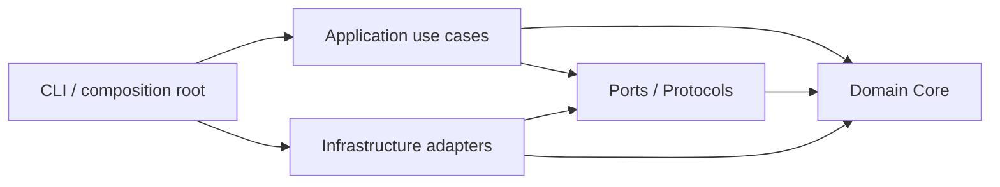

# Norma de engenharia — Clean Code, SOLID e Definition of Done

> [!important] Regra absoluta
> Todo código da Factory deve respeitar Clean Code, SOLID e os controles aplicáveis de [security-review.md](security-review.md). Uma fatia funcional que viola esta norma não está concluída. Pressão de prazo, resultado de modelo ou sucesso de teste isolado não autorizam atalhos.

## 1. Escopo e precedência

Esta norma aplica-se a código de produção, testes, scripts, prompts versionados, schemas, migrations, automações e documentação técnica. Ela é herdada por todas as tasks de [plan.md](plan.md).

Em caso de conflito, a ordem é:

1. invariantes de segurança e proteção de dados;
2. contratos de domínio e critérios de aceite;
3. esta norma de engenharia;
4. conveniência de implementação.

Princípios são obrigatórios. Uma exceção técnica mensurável — por exemplo, complexidade temporária numa migration — exige ADR com justificativa, risco, responsável, prazo de remoção e aprovação humana. Não há exceção local para segredos, `shell=True`, bypass de autorização, push/merge automático ou execução de repositório não confiável no host.

## 2. SOLID como regra verificável

| Princípio | Regra na Factory | Evidência mínima |
|---|---|---|
| SRP — responsabilidade única | Classe, módulo ou caso de uso tem um motivo coeso para mudar. Orquestração não implementa Git, SQL, subprocesso ou parsing de provider. | revisão de design, módulos coesos e testes focados |
| OCP — aberto/fechado | Novo worker, gate, store ou estratégia entra por adapter/registry; não cria `if/elif` de provider no Core. | contract test do novo adapter sem alterar políticas centrais |
| LSP — substituição | Toda implementação preserva semântica, tipos, falhas, timeout e cancelamento definidos pela porta. | mesma suíte de contract tests para todas as implementações |
| ISP — segregação de interfaces | `Protocol`s são pequenos e orientados ao consumidor; nenhuma interface onipotente de worker, storage ou tool. | dependentes recebem apenas as capacidades que usam |
| DIP — inversão de dependência | Core e Application dependem de portas; adapters dependem dessas portas. Concretos são ligados somente no composition root. | teste automático de fronteiras de import e ausência de service locator |

Dependências permitidas:



`core` não importa `application`, `adapters`, CLI, ORM, SDKs de provider ou detalhes de sistema operacional. `application` não importa adapters concretos. Exceções são bloqueadas por teste de arquitetura.

## 3. Clean Code em Python

- nomes expressam o vocabulário do domínio; siglas obscuras, nomes genéricos e booleanos ambíguos são evitados;
- funções fazem uma coisa observável, mantêm fluxo simples e extraem decisões de negócio para políticas nomeadas;
- não há números, strings de estado, timeouts ou paths mágicos; valores vêm de tipos, enums ou configuração validada;
- APIs públicas e fronteiras possuem typing completo; `Any`, casts e ignores precisam ser estreitos e justificados;
- value objects são imutáveis quando representam identidade, hash, commit, estado ou decisão;
- dependências como relógio, gerador de ID, filesystem, runner e stores são injetadas; não há estado global mutável nem service locator;
- Core é determinístico e concentra regras puras; I/O e efeitos colaterais ficam nos adapters;
- exceções representam o domínio e preservam a causa; não se usa `except Exception: pass`, retorno sentinela ambíguo ou captura ampla sem normalização e telemetria;
- comentários e docstrings explicam contrato, risco e motivo, não repetem a sintaxe;
- regra de negócio tem uma fonte autoritativa; duplicação acidental é removida, sem criar abstração prematura;
- complexidade, tamanho e acoplamento são sinais de revisão e refatoração, não metas para “jogar com a métrica”;
- código gerado por IA recebe exatamente a mesma revisão, análise estática e teste que código humano.

## 4. Contratos e desenho evolutivo

- portas usam `typing.Protocol` e modelos de domínio, nunca payloads crus de fornecedor;
- adapters traduzem formatos externos e falham de forma explícita em versão/capability incompatível;
- funções públicas documentam precondições, pós-condições, falhas e efeitos colaterais relevantes;
- mudanças incompatíveis em schema, evento, artifact ou CLI exigem versionamento e migration;
- decisões que alteram fronteiras, invariantes, autoridade ou armazenamento exigem ADR;
- abstração só entra quando protege uma variação conhecida, uma fronteira de confiança ou um contrato testável.

## 5. Estratégia de testes

- teste segue Arrange–Act–Assert, é determinístico e não depende da ordem da suíte;
- unit tests cobrem políticas e Core sem rede, relógio real ou filesystem global;
- contract tests são compartilhados entre implementações de cada porta;
- integration tests usam SQLite, Git e subprocessos reais em diretórios temporários controlados;
- property-based e fuzz tests cobrem parsers, state machine, normalizadores, paths e schemas hostis;
- regressão acompanha todo bug corrigido e todo controle de segurança relevante;
- mocks verificam fronteiras, não reproduzem internamente a implementação;
- smoke tests de providers reais são opt-in e nunca requisito de CI sem credencial/cota disponível.

## 6. Gates obrigatórios

O comando canônico deve agregar, no mínimo:

```bash
uv lock --check
uv run ruff check src tests
uv run ruff format --check src tests
uv run pyright src tests
uv run lint-imports
uv run pytest --cov=ai_software_factory --cov-branch
uv run pip-audit
uv build
```

Também são obrigatórios:

- secret scan no repositório e no diff, com baseline revisada e sem “allow” genérico;
- export de SBOM CycloneDX na qualificação de release;
- validação de migrations, schemas e documentação quando alterados;
- revisão humana para mudanças de segurança, autorização, execução de processo ou trust boundary.

Ruff deve habilitar famílias relevantes de bugs, segurança e complexidade, com ignores locais e justificados. Pyright começa em modo estrito. `import-linter` — ou verificador equivalente — materializa as fronteiras arquiteturais. O `pip-audit` verifica o conjunto resolvido/locked; achado sem correção disponível precisa de análise de risco registrada, não de supressão silenciosa.

## 7. Definition of Done global

Uma task só pode ser marcada como concluída quando:

- [ ] entrega o valor e todos os critérios de aceite da própria task;
- [ ] respeita os cinco princípios SOLID e as fronteiras de dependência;
- [ ] não introduz duplicação de regra, estado global ou bypass de porta;
- [ ] possui testes proporcionais ao risco, incluindo regressão negativa;
- [ ] passa todos os gates globais aplicáveis em ambiente reproduzível;
- [ ] atualiza documentação, schema, migration e ADR aplicáveis;
- [ ] passa os controles e testes de [security-review.md](security-review.md);
- [ ] deixa evidência reproduzível, sem segredos, vinculada à alteração;
- [ ] não amplia autoridade, rede, filesystem ou custo sem aprovação explícita;
- [ ] tem revisão humana quando afeta trust boundary ou invariantes.

## 8. Política de revisão

Pull requests e revisões devem responder, com evidência:

1. qual responsabilidade mudou e por quê;
2. qual porta/contrato protege a mudança;
3. quais cenários felizes, de falha e abuso foram testados;
4. quais trust boundaries ou permissões foram afetados;
5. como rollback, retomada e observabilidade se comportam;
6. se uma nova dependência é necessária, fixada, auditada e refletida na SBOM.

“O modelo gerou”, “o lint passou” ou “funciona localmente” não constituem justificativa de design.
