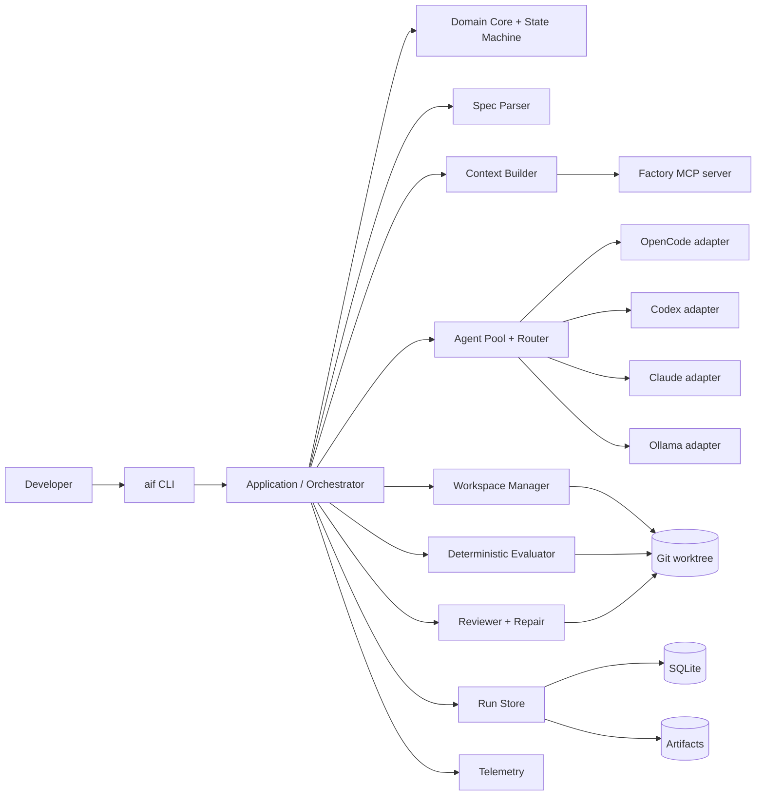
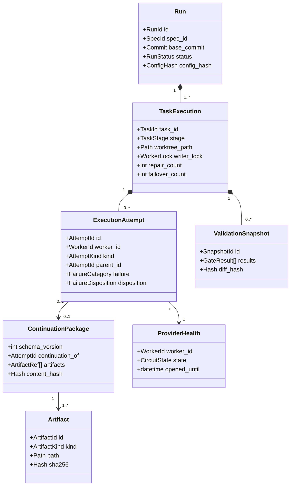
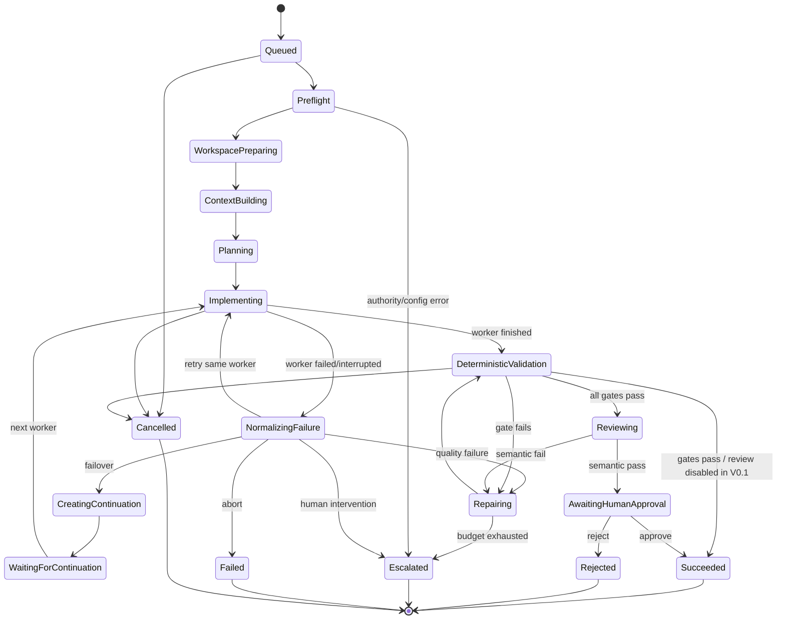
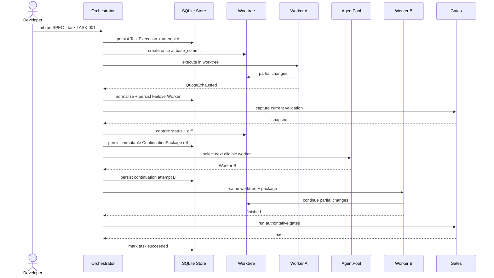

# Plano de implementação da AI Software Factory

## 1. Resultado esperado

Entregar uma Factory local, assíncrona e auditável que transforma uma SPEC em alterações isoladas, valida evidências, troca de worker sem perder trabalho, repara falhas de qualidade, solicita revisão independente, preserva aprovação humana e mede objetivamente arquiteturas agentic.

O plano começa em um diretório vazio e termina na V1.1. As decisões que resolveram ambiguidades estão em [brainstorming.md](brainstorming.md).

> [!important] Norma obrigatória
> Toda implementação e toda task herdam a [norma de engenharia](engineering-standards.md) e os controles do [threat model e revisão de segurança](security-review.md). Clean Code, SOLID e secure-by-design são critérios de conclusão, não recomendações. Sucesso funcional sem conformidade não encerra uma task.

## 2. Escopo da V1.1

### Incluído

- CLI Python empacotada com `uv`;
- contrato de SPEC Markdown estrito;
- SQLite e artifacts locais;
- Git worktree por task e lock de writer;
- gates determinísticos configuráveis;
- adapters OpenCode, Codex e Claude Code;
- planner local opcional via Ollama;
- AgentPool, Failure Normalizer, Circuit Breaker e Continuation Package;
- reviewer independente, repair loop e human gate;
- Context Builder determinístico e MCP semântico via stdio;
- traces/métricas OpenTelemetry e logs JSONL;
- benchmark com base Git imutável e hidden tests;
- retomada idempotente, timeout, cancellation e chaos tests;
- roteamento dinâmico explicável;
- paralelismo limitado a tasks independentes de uma DAG.

### Não incluído

- UI web, serviço remoto ou multiusuário;
- Kubernetes, filas, Redis ou PostgreSQL;
- vector database;
- shell genérico via MCP;
- decomposição autônoma da SPEC;
- auto-merge ou auto-push;
- workers distribuídos;
- treinamento/fine-tuning de modelos.

## 3. Princípios e invariantes

1. Clean Code, SOLID e o Definition of Done global são obrigatórios em todo código e task.
2. Uma task pertence à Factory, não ao worker.
3. `TaskExecution` mantém o mesmo `run_id`, `task_id`, `base_commit` e worktree durante retry, failover e repair.
4. Só existe um writer ativo por task.
5. Nenhum sucesso existe sem gates determinísticos aprovados.
6. Falha operacional não degrada a qualidade da implementação; falha de qualidade não degrada a saúde do provider.
7. Toda transição relevante persiste estado e evento na mesma transação.
8. Core e Application dependem de portas, nunca de adapters concretos; o Core nunca interpreta texto específico de provider.
9. Workers não recebem autoridade para commit, push, merge ou acesso externo irrestrito.
10. SPEC, repositório, model output, MCP e subprocessos são entradas não confiáveis; conteúdo nunca concede autoridade.
11. Segredos não entram em prompts, events, logs ou Continuation Packages.
12. Roteamento e gates precisam explicar a decisão com evidências.
13. Approval humana é obrigatória até a V1.1 e vincula o hash exato do diff e o base commit.
14. Toda operação externa tem timeout, cancelamento, limite de recursos e resultado persistido.
15. Sem isolamento forte, código de repositório não confiável não é executado no host.

## 4. Arquitetura de alto nível



O produto será um monólito modular. As setas representam dependências por portas (`Protocol`), não imports indiscriminados de infraestrutura no domínio. Um teste de arquitetura bloqueia imports de adapters no Core/Application e cada porta possui contract tests compartilhados, materializando DIP, ISP e LSP.

## 5. Modelo de domínio — UML



## 6. Máquina de estados — UML



V0.1 usa apenas os estados necessários até validação/sucesso, incluindo continuação; sua política desabilita review e human gate. Review, human gate e scheduler são ativados nas releases posteriores sem trocar a identidade do agregado.

## 7. Sequência crítica: failover com continuação



## 8. Sequência da V1.1: paralelismo seguro

```mermaid
sequenceDiagram
    participant Sch as DAG Scheduler
    participant Lock as Task Lock Manager
    participant T2 as TASK-002 worktree
    participant T3 as TASK-003 worktree
    participant DB as SQLite

    Sch->>Sch: validate dependencies and base commit
    par independent TASK-002
        Sch->>Lock: acquire TASK-002
        Lock-->>Sch: granted
        Sch->>T2: execute pipeline
        Sch->>DB: short transactions, own session
    and independent TASK-003
        Sch->>Lock: acquire TASK-003
        Lock-->>Sch: granted
        Sch->>T3: execute pipeline
        Sch->>DB: short transactions, own session
    end
    Sch->>Sch: collect outcomes; do not auto-merge
```

## 9. Estrutura alvo do repositório

```text
ai-software-factory/
├── AGENTS.md
├── CLAUDE.md
├── .agents/
│   ├── skills/
│   └── reviewers/
├── .claude/
│   ├── skills/
│   └── agents/
├── .codex/
│   └── agents/
├── pyproject.toml
├── uv.lock
├── factory.example.toml
├── README.md
├── src/ai_software_factory/
│   ├── cli.py
│   ├── config.py
│   ├── core/
│   │   ├── models.py
│   │   ├── events.py
│   │   ├── failures.py
│   │   ├── policies.py
│   │   └── state_machine.py
│   ├── application/
│   │   ├── orchestrator.py
│   │   ├── scheduler.py
│   │   └── services.py
│   ├── ports/
│   │   ├── workers.py
│   │   ├── persistence.py
│   │   ├── processes.py
│   │   └── workspace.py
│   ├── adapters/
│   │   ├── agents/
│   │   ├── git/
│   │   ├── persistence/
│   │   └── process/
│   ├── evaluation/
│   ├── context/
│   ├── mcp/
│   ├── observability/
│   └── benchmarks/
├── prompts/
├── schemas/
├── migrations/
├── examples/
├── docs/
│   ├── adr/
│   ├── security/
│   └── planejamento/
│       └── task-template.md
├── scripts/
│   ├── validate_tasks.py
│   └── show_manual_validation.py
├── tests/
│   ├── unit/
│   ├── integration/
│   ├── contract/
│   ├── property/
│   ├── security/
│   ├── chaos/
│   └── release/
└── .github/
    └── pull_request_template.md
```

## 10. Persistência e artifacts

### Fonte operacional

SQLite com WAL, foreign keys, `busy_timeout` e migrations versionadas. Cada unidade concorrente cria sua própria `AsyncSession`; transações mantêm-se curtas.

Tabelas mínimas:

- `runs`;
- `task_executions`;
- `execution_attempts`;
- `events`;
- `validation_snapshots`;
- `provider_health`;
- `continuation_packages`;
- `artifacts`;
- `approvals`;
- `benchmark_runs`.

### Diretório de runtime

```text
~/.aifactory/
├── state.db
├── locks/
├── runs/<run-id>/
│   ├── events.ndjson
│   ├── spec.md
│   ├── plan.json
│   ├── context-manifest.json
│   ├── checkpoints/
│   ├── validations/
│   ├── reviews/
│   └── continuations/
└── worktrees/<repo>/<run-id>/<task-id>/
```

Artifacts são escritos por arquivo temporário + rename atômico, recebem SHA-256 e nunca são sobrescritos. Diretórios de runtime usam permissão `0700`; DB, locks e artifacts sensíveis usam `0600`. Paths são canonicalizados contra a raiz autorizada e operações não seguem symlinks para fora dela.

## 11. Contratos públicos principais

| Porta/contrato | Responsabilidade |
|---|---|
| `SpecParser` | Converter a gramática Markdown suportada em `SoftwareSpec` |
| `RunStore` | Transações de estado + evento e consultas de retomada |
| `ArtifactStore` | Persistir payloads grandes, imutáveis e sanitizados |
| `WorkspaceManager` | Criar, inspecionar, bloquear e remover worktrees |
| `ProcessRunner` | Subprocesso sem shell, streaming, timeout e cancelamento |
| `AgentWorker` | Emitir `AsyncIterator[AgentEvent]` normalizado |
| `FailureNormalizer` | Traduzir falhas específicas para taxonomia de domínio |
| `AgentPoolSelector` | Explicar elegibilidade, exclusões e seleção |
| `ValidationGate` | Produzir evidência determinística e persistível |
| `ContextBuilder` | Criar manifest com proveniência e hashes |
| `Reviewer` | Mapear cada AC para pass/fail/unknown + evidência |
| `TaskScheduler` | Executar uma DAG sem dois writers na mesma task |

## 12. Releases e gates

| Release | Tasks | Valor entregue | Gate de release |
|---|---:|---|---|
| V0.1 | 1–14, 32 | Pipeline real com automação agnóstica, OpenCode, worktree, estado, gates e failover sem perder diff | Claude/Codex compartilham política; Fake #1 quota → Fake #2 continua; OpenCode passa contract/security tests; dossier V0.1 |
| V0.2 | 15–18 | Codex reviewer, repair limitado e aprovação/commit seguros | ACs estruturados; repair revalida; approval exata e TOCTOU testado |
| V0.3 | 19–22 | Contexto, Claude, Ollama e perfis reproduzíveis | Manifest/hash estáveis; Ollama loopback; fallback sem custo oculto; dossier V0.3 |
| V0.4 | 23–24 | MCP semântico e observabilidade segura | MCP stdio isolado; traces/métricas redigidos; dossier V0.4 |
| V0.5 | 25–26 | Benchmark de cinco tasks com hidden tests | Mesma base/budget, isolamento comprovado, raw results e dossier V0.5 |
| V1.0 | 27–28 | Recovery, idempotência, cancellation e hardening | Chaos/security matrix, upgrade/recovery e dossier V1.0 |
| V1.1 | 29–31 | Roteamento por evidência, DAG paralela e qualificação ampliada | Decisões explicáveis, isolamento concorrente e release dossier completo |

## 13. Backlog executável

Cada arquivo segue o [template normativo](task-template.md) e é validado por `python3 scripts/validate_tasks.py`. Pode existir no máximo uma task `ready`; zero é permitido enquanto a task concluída aguarda integração ou a próxima ainda não recebeu baseline. Uma task planejada recebe baseline SHA e é ativada apenas após todas as dependências terem evidência aprovada.

| ID | Arquivo | Fatia de valor | Depende de |
|---|---|---|---|
| TASK-001 | [task1.md](task1.md) | Bootstrap reproduzível e `aif doctor` | — |
| TASK-002 | [task2.md](task2.md) | SPEC validável pela CLI | 1 |
| TASK-003 | [task3.md](task3.md) | Modelo de domínio e state machine | 2 |
| TASK-004 | [task4.md](task4.md) | Ledger SQLite transacional | 3 |
| TASK-005 | [task5.md](task5.md) | ArtifactStore e consultas auditáveis | 4 |
| TASK-006 | [task6.md](task6.md) | ProcessRunner seguro e limitado | 5 |
| TASK-007 | [task7.md](task7.md) | Worktree/lock/cleanup seguros | 6 |
| TASK-032 | [task32.md](task32.md) | Automação agnóstica de agentes | 7 |
| TASK-008 | [task8.md](task8.md) | Gates determinísticos e snapshots | 32 |
| TASK-009 | [task9.md](task9.md) | Pipeline E2E offline com FakeWorker | 8 |
| TASK-010 | [task10.md](task10.md) | Taxonomia e seleção estática | 9 |
| TASK-011 | [task11.md](task11.md) | Circuit breaker e provider health | 10 |
| TASK-012 | [task12.md](task12.md) | Continuação/failover retomável | 11 |
| TASK-013 | [task13.md](task13.md) | Adapter OpenCode protegido | 12 |
| TASK-014 | [task14.md](task14.md) | Qualificação e release V0.1 | 13 |
| TASK-015 | [task15.md](task15.md) | Adapter Codex protegido | 14 |
| TASK-016 | [task16.md](task16.md) | Reviewer estruturado por AC | 15 |
| TASK-017 | [task17.md](task17.md) | Repair loop limitado | 16 |
| TASK-018 | [task18.md](task18.md) | Human gate, commit seguro e V0.2 | 17 |
| TASK-019 | [task19.md](task19.md) | Context Builder reproduzível | 18 |
| TASK-020 | [task20.md](task20.md) | Adapter Claude protegido | 18 |
| TASK-021 | [task21.md](task21.md) | Planner Ollama local | 19, 20 |
| TASK-022 | [task22.md](task22.md) | Perfis/fallback e V0.3 | 21 |
| TASK-023 | [task23.md](task23.md) | MCP semântico isolado | 22 |
| TASK-024 | [task24.md](task24.md) | Observabilidade segura e V0.4 | 23 |
| TASK-025 | [task25.md](task25.md) | Harness de benchmark | 24 |
| TASK-026 | [task26.md](task26.md) | Dataset/hidden tests e V0.5 | 25 |
| TASK-027 | [task27.md](task27.md) | Recovery/idempotência | 26 |
| TASK-028 | [task28.md](task28.md) | Cancellation/chaos e V1.0 | 27 |
| TASK-029 | [task29.md](task29.md) | Router dinâmico explicável | 28 |
| TASK-030 | [task30.md](task30.md) | Scheduler DAG paralelo e isolado | 29 |
| TASK-031 | [task31.md](task31.md) | Qualificação e release V1.1 | 30 |

### Grafo de dependências

```mermaid
flowchart LR
    T1["1 Bootstrap"] --> T2["2 SPEC"] --> T3["3 Domain"] --> T4["4 SQLite"] --> T5["5 Artifacts"] --> T6["6 Process"] --> T7["7 Worktree"] --> T8["8 Gates"] --> T9["9 Fake E2E"]
    T9 --> T10["10 Pool"] --> T11["11 Circuit"] --> T12["12 Continuation"] --> T13["13 OpenCode"] --> T14["14 V0.1"]
    T14 --> T15["15 Codex"] --> T16["16 Review"] --> T17["17 Repair"] --> T18["18 Approval / V0.2"]
    T18 --> T19["19 Context"]
    T18 --> T20["20 Claude"]
    T19 --> T21["21 Ollama"]
    T20 --> T21
    T21 --> T22["22 Profiles / V0.3"] --> T23["23 MCP"] --> T24["24 OTel / V0.4"]
    T24 --> T25["25 Harness"] --> T26["26 Dataset / V0.5"] --> T27["27 Recovery"] --> T28["28 Chaos / V1.0"]
    T28 --> T29["29 Router"] --> T30["30 DAG"] --> T31["31 V1.1"]
```



## 14. Estratégia de testes

| Camada | Exemplos | Provider real? |
|---|---|---|
| Unit | parser, state machine, policies, scope matcher, redaction | Não |
| Contract | eventos de cada adapter a partir de fixtures gravadas | Não |
| Architecture | fronteiras de import, ciclos e composição por portas | Não |
| Infrastructure | Git real temporário, SQLite real temporário, subprocesso fake | Não |
| Integration | pipeline com FakeWorkers editando worktree real | Não |
| Security/abuse | injection, traversal/symlink, canary secret, output hostil, TOCTOU e limites | Não |
| Smoke | um prompt mínimo por CLI instalado | Sim, opt-in |
| Benchmark | tasks do `factory-lab` em base imutável | Sim, perfil controlado |
| Chaos | kill points, timeout, DB locked, invalid JSON, quota parcial | Não |

Gates do próprio repositório:

```bash
uv lock --check
uv run ruff check src tests
uv run ruff format --check src tests
uv run pyright src tests
uv run lint-imports
uv run pytest --cov=ai_software_factory --cov-branch
uv run pip-audit
uv build
```

O pipeline inclui secret scan no repositório/diff; a qualificação de release exporta SBOM CycloneDX e provenance. Ruff habilita regras de bugs, segurança e complexidade com exceções locais justificadas; Pyright inicia estrito. Cobertura não será um número isolado de sucesso. O gate exigirá 100% das transições de estado e políticas críticas cobertas; o restante terá meta inicial de 85% de branch coverage.

## 15. Segurança e controle de custo

- o [threat model](security-review.md) e NIST SSDF 1.1 orientam o secure SDLC; mudanças de trust boundary exigem revisão;
- `no_incremental_cost = true` por padrão;
- preflight bloqueia credenciais de API por consumo quando o perfil proíbe;
- tokens de autenticação nunca são logados ou copiados para artifacts;
- ambiente de subprocesso é allowlist;
- comandos são arrays de argumentos, nunca `shell=True`, com executável/cwd permitido e limites de tempo, output e recursos;
- gates executam com HOME/TMP efêmeros, sem credenciais desnecessárias e com hooks Git desabilitados;
- repositório não confiável exige container/VM/sandbox forte com rede negada; sem ele a execução falha fechada;
- paths são canonicalizados e testados contra traversal, symlink escape e TOCTOU;
- worktree e allowed scope são fronteiras distintas e ambas obrigatórias;
- conteúdo do repositório é dado não confiável, nunca policy; output de modelo/MCP é validado por schema e não autoriza ação;
- OpenCode recebe regras explícitas deny-by-default;
- Codex usa `--sandbox workspace-write`; reviewer usa read-only;
- Claude reviewer recebe permissões read-only e saída estruturada;
- `external_directory`, web e Bash ficam negados salvo capacidade justificada;
- SecretGate examina apenas o diff e bloqueia `.env`, private keys e padrões de token;
- dependências são locked, auditadas e incluídas em SBOM; suppressions têm owner, risco e expiração;
- aprovação humana é registrada com timestamp, ator, base commit, worktree e hash do diff aprovado; mudança invalida a aprovação.

## 16. Observabilidade e métricas

### Correlação obrigatória

Todo log, span, métrica, evento e artifact referencia quando aplicável:

```text
run_id, task_id, attempt_id, worker_id, provider, role, base_commit, prompt_hash, config_hash
```

### Métricas mínimas

- `factory_runs_total` por outcome;
- `task_first_pass_success_total` e `task_final_success_total`;
- `agent_execution_duration_seconds`;
- `agent_failures_total` por categoria;
- `failovers_total`, `repairs_total` e `continuations_total`;
- `gate_duration_seconds` e `gate_failures_total`;
- `context_files`, `context_bytes` e `context_build_duration_seconds`;
- `provider_circuit_state`;
- `scheduler_active_tasks` e `scheduler_queue_depth`;
- tokens quando o provider os expuser, sem tratá-los automaticamente como custo monetário.

IDs de task ou run não entram como labels de métricas para evitar alta cardinalidade; ficam nos traces/logs.

## 17. Política de retomada e idempotência

- chave de comando: `run_id + task_id + stage + ordinal`;
- efeitos externos usam registro `started/completed/failed`;
- reinício após `Implementing` encerra a attempt interrompida, captura o worktree e aplica a política;
- worktree existente só é reutilizado se repository, base commit e task coincidirem;
- criação de pacote e início da continuação são operações separadas e retomáveis;
- Ctrl+C cancela o grupo de tasks, encerra processos filhos e preserva evidências;
- cleanup é explícito e nunca executado automaticamente após falha.

## 18. Critérios finais da V1.1

- [ ] `uv sync --locked` reproduz o ambiente.
- [ ] Clean Code, SOLID, import boundaries e o DoD global passam sem exceção não registrada.
- [ ] Python 3.13 e 3.14 passam nos gates suportados.
- [ ] SPEC inválida falha antes de criar worktree.
- [ ] Cada task possui worktree e lock exclusivos.
- [ ] Fake quota → continuação preserva diff, identidade e evidência.
- [ ] Ao menos OpenCode, Codex e Claude passam contract tests; smoke real é opt-in.
- [ ] Gates determinísticos são configuráveis como listas de argumentos seguras.
- [ ] Reviewer mapeia todos os ACs para pass/fail/unknown com evidência.
- [ ] Repair e failover possuem budgets e métricas separados.
- [ ] Context manifest contém razão, caminho, hash e tamanho.
- [ ] MCP expõe tools semânticas, nunca execução arbitrária.
- [ ] Estado e eventos permitem retomar todos os kill points suportados.
- [ ] Roteamento registra candidatos, exclusões, score e decisão.
- [ ] Tasks independentes executam em paralelo; dependentes aguardam; a mesma task nunca tem dois writers.
- [ ] Nenhum worker faz commit, push ou merge.
- [ ] Aprovação humana referencia o hash exato do diff.
- [ ] A aprovação referencia também base commit/worktree e é invalidada por qualquer mudança posterior.
- [ ] Benchmark e relatório podem ser repetidos a partir do mesmo base commit.
- [ ] SAST/Ruff security, dependency audit, secret scan, SBOM e provenance passam.
- [ ] Casos de abuso cobrem prompt injection, output hostil, traversal/symlink, segredo-canário, TOCTOU e consumo sem limite.
- [ ] Repositório marcado como não confiável falha fechado quando isolamento forte não está disponível.
- [ ] Checklist do threat model e matriz de chaos tests passam.

## 19. Riscos e mitigação

| Risco | Mitigação |
|---|---|
| Formatos de CLI mudarem | Contract fixtures versionadas, capability discovery e erro explícito |
| Quota inviabilizar smoke/benchmark | Fakes em CI, perfis de custo, suite estratificada e execução real opt-in |
| Dual write DB/arquivo divergir | SQLite autoritativo e export NDJSON reconstruível |
| SQLite bloquear com paralelismo | WAL, transações curtas, sessões por task, busy timeout e métricas de contention |
| Agente acessar fora do worktree | Sandbox do provider + external directory deny + scope gate |
| Código de build/test comprometer o host | Trust profile; HOME/TMP efêmeros; sem credenciais/rede; isolamento forte para repo não confiável |
| Prompt injection elevar conteúdo a policy | Separar policy/dados, autoridade mínima, schema, gates e testes adversariais |
| Symlink/path traversal escapar da raiz | Canonicalização, APIs seguras, validação no uso e testes TOCTOU |
| Dependência ou CLI comprometida | Lock, audit, provenance, SBOM, versão/origem e revisão de novas dependências |
| Aprovação ficar obsoleta antes do commit | Vínculo base+diff+worktree, revalidação imediata e invalidação automática |
| Parser Markdown aceitar ambiguidade | Gramática pequena, erro fail-fast e golden tests |
| Router reforçar dados ruins | Baseline estático preservado, feature flags e explicação por decisão |
| Benchmark vazar hidden tests | Injeção após término do worker e armazenamento fora do worktree visível |
| Contexto crescer sem limite | Budget determinístico, manifest e truncation policy auditável |
| Paralelismo causar conflito posterior | Apenas DAG independente; sem merge automático; base commit registrado |

## 20. Fluxo de execução das tasks deste plano

1. A Factory/humano verifica as dependências aprovadas, atualiza `dev`, fixa `baseline_commit` no SHA de `origin/dev` e promove exatamente uma task de `planned` para `ready`.
2. A execução cria `task/TASK-NNN-descricao` a partir desse baseline; nenhuma task inicia em `main`.
3. O agente executa o preflight e todas as regras de [AGENTS.md](../../AGENTS.md); se baseline/paths/decisões divergirem, para sem editar.
4. O agente implementa somente os arquivos permitidos e executa cada linha da Matriz de verificação.
5. O agente executa os gates globais, revisa o diff e imprime no terminal as instruções da seção `Validação manual no terminal` via `python3 scripts/show_manual_validation.py TASK-NNN`.
6. Sem pedir autorização adicional, o agente cria commit, publica a branch e abre/atualiza automaticamente um draft PR para `dev` usando `gh`; nunca faz push direto em `dev`/`main` nem auto-merge.
7. A Factory/humano faz a validação manual, revisa o draft PR, solicita ajustes na mesma branch ou integra em `dev`; somente então pode ativar a próxima task.
8. A última task de cada versão executa o gate/dossier; promoção ocorre por PR `dev → main` e publicação/tag continuam humanas.
9. Decisão que altere invariantes, contratos públicos, autoridade ou trust boundary exige ADR/task próprios, nunca escolha local do agente.

O [template normativo](task-template.md) exige Definition of Ready, precondições, baseline, paths, interfaces, defaults, riscos, critérios identificados, correspondência AC → comando → teste → evidência e instruções de validação manual imprimíveis. O validador documental bloqueia task inconsistente antes da execução.

Não usar estimativas de calendário sem velocidade observada. Depois da V0.1, medir lead time, retrabalho e taxa de sucesso por task para estimar as releases seguintes.

## 21. Referências oficiais

- [uv — projects and lockfiles](https://docs.astral.sh/uv/concepts/projects/)
- [NIST SP 800-218 — SSDF 1.1](https://csrc.nist.gov/pubs/sp/800/218/final)
- [NIST SP 800-218A — SSDF profile for GenAI](https://csrc.nist.gov/pubs/sp/800/218/a/final)
- [OWASP ASVS 5.0.0](https://owasp.org/www-project-application-security-verification-standard/)
- [OWASP Top 10 for LLM Applications 2025](https://genai.owasp.org/llm-top-10/)
- [OWASP Top 10 for Agentic Applications 2026](https://genai.owasp.org/resource/owasp-top-10-for-agentic-applications-for-2026/)
- [OWASP Software Component Verification Standard](https://owasp.org/www-project-software-component-verification-standard/)
- [Python — asyncio subprocesses](https://docs.python.org/3/library/asyncio-subprocess.html)
- [Python — subprocess security considerations](https://docs.python.org/3/library/subprocess.html#security-considerations)
- [Python — security considerations](https://docs.python.org/3/library/security_warnings.html)
- [Python — TaskGroup and cancellation](https://docs.python.org/3.14/library/asyncio-task.html)
- [Git — worktree](https://git-scm.com/docs/git-worktree)
- [SQLAlchemy — asyncio](https://docs.sqlalchemy.org/en/20/orm/extensions/asyncio.html)
- [OpenAI Codex — non-interactive mode](https://developers.openai.com/codex/non-interactive-mode)
- [OpenAI Codex — authentication](https://developers.openai.com/codex/auth)
- [Claude Code — programmatic usage](https://code.claude.com/docs/en/headless)
- [OpenCode — CLI](https://opencode.ai/docs/cli/)
- [OpenCode — permissions](https://opencode.ai/docs/permissions/)
- [Ollama — Qwen 3.5 9B](https://ollama.com/library/qwen3.5:9b)
- [MCP Python SDK](https://py.sdk.modelcontextprotocol.io/)
- [OpenTelemetry Python](https://opentelemetry.io/docs/languages/python/)
- [SQLite — WAL](https://sqlite.org/wal.html)
