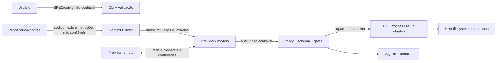

# Revisão de engenharia e threat model de segurança

## 1. Parecer executivo

O plano original já adota controles sólidos: Core determinístico, worktree por task, um writer, gates independentes do LLM, least privilege, comandos sem shell, ambiente filtrado, redaction, budgets, circuit breaker, revisão e aprovação humana.

Ele ainda não atendia integralmente às melhores práticas porque não tornava Clean Code/SOLID verificáveis e não explicitava threat model, supply chain, paths/symlinks, permissões locais, hooks Git, prompt injection, TOCTOU da aprovação nem a diferença entre processo filtrado e isolamento forte. Este documento fecha a especificação dessas lacunas e sua implementação está distribuída nas tasks.

> [!warning] Limite de confiança da V1.1
> A V1.1 é qualificada para laboratório local, mono-tenant e repositórios confiáveis. Executar build, teste, hook ou código de um repositório arbitrário no host pode comprometer credenciais e arquivos mesmo com `env` filtrado. Repositório não confiável deve rodar em container/VM/sandbox forte, sem segredos, com rede negada por padrão e limites de recursos; sem esse perfil a Factory falha fechada.

## 2. Baselines adotadas

- [NIST SP 800-218 SSDF 1.1](https://csrc.nist.gov/pubs/sp/800/218/final) como baseline estável do secure SDLC;
- [NIST SP 800-218A](https://csrc.nist.gov/pubs/sp/800/218/a/final) como perfil de desenvolvimento seguro para GenAI;
- [OWASP ASVS 5.0.0](https://owasp.org/www-project-application-security-verification-standard/) como catálogo técnico aplicável, adaptado ao produto local;
- [OWASP Top 10 for LLM Applications 2025](https://genai.owasp.org/llm-top-10/) para prompt injection, dados sensíveis, supply chain, output handling, excessive agency e consumo sem limite;
- [OWASP Top 10 for Agentic Applications 2026](https://genai.owasp.org/resource/owasp-top-10-for-agentic-applications-for-2026/) para goal hijack, tool misuse, privilégios, execução inesperada, poisoning e falhas em cascata;
- [OWASP SCVS](https://owasp.org/www-project-software-component-verification-standard/) para componentes e dependências.

O SSDF 1.2 está em draft; até publicação final, 1.1 é a baseline normativa e o draft é apenas acompanhado.

## 3. Ativos protegidos

- código-fonte, histórico Git, SPEC, critérios de aceite e hidden tests;
- credenciais, arquivos de autenticação de CLIs, keychain, SSH agent e variáveis do usuário;
- home do usuário e arquivos fora do worktree;
- banco SQLite, events, prompts, context manifests, diffs e artifacts;
- identidade do run, base commit, locks, decisões, aprovações e evidências;
- disponibilidade do host, quotas, tokens, tempo e custo de providers;
- integridade de dependências, modelos locais, binaries e ferramentas MCP.

## 4. Entradas sempre não confiáveis

SPEC e arquivos do repositório, nomes/paths, output de Git e subprocessos, respostas/model output de providers, JSON estruturado, argumentos e resultados MCP, métricas históricas de roteamento, pacotes de continuação e fixtures importadas são dados não confiáveis. Conteúdo do repositório nunca pode elevar-se a política da Factory.

## 5. Trust boundaries

Toda seta é mediada por validação, autorização, limite de recursos, schema/tipo, telemetria sanitizada e política fail-closed.

## 6. Ameaças e controles obrigatórios

| Ameaça | Controles requeridos | Tasks principais |
|---|---|---|
| Prompt injection e agent goal hijack | separar policy de dados; rotular conteúdo do repo; ignorar instruções embutidas; output nunca autoriza ação; testes adversariais | 2, 8–9, 13, 15–16, 19–24, 29 |
| Excessive agency/tool misuse | allowlist de capabilities; menor privilégio; deny network/external dirs; mediação em cada tool; human gate | 6, 8–9, 13, 15–18, 21–23 |
| Command injection | argumentos tipados/array; `shell=False`; sem shell MCP; allowlist de executáveis e subcomandos; validação de paths | 2, 6–8, 23 |
| Path traversal e symlink escape | canonicalização contra raiz; `openat`/sem seguir symlink quando aplicável; operações atômicas; testes TOCTOU | 2, 5–8, 12, 19, 23, 26–28 |
| Código de build/test malicioso | trust profile; HOME/TMP efêmeros; zero credenciais; hooks desativados; rede negada; container/VM para não confiável | 6–8, 26, 31 |
| Vazamento de segredo | env allowlist; redaction estrutural; SecretGate; permissões 0700/0600; prompts/artifacts sem auth; testes canário | 1, 5–9, 12–24, 26–31 |
| Insecure output handling | schema estrito, limites de bytes/itens/profundidade, escaping contextual, nunca `eval`/pickle inseguro | 2, 5–6, 8–24 |
| Supply chain comprometida | lock obrigatório; provenance/hash; dependency audit; secret/SAST scan; SBOM; revisão de nova dependência/modelo | 1, 14, 22, 24, 28, 31 |
| TOCTOU na aprovação | aprovação vincula base commit + diff hash + worktree; gates repetidos imediatamente antes do commit; mudança invalida aprovação | 7, 18, 27–28, 31 |
| Confused deputy/cross-run | autorização por run/task em toda tool; objetos não adivinháveis; locks; sessão MCP isolada; sem cache cruzado | 4–5, 7, 11–12, 23, 27, 30 |
| DoS e consumo sem limite | timeout, cancelamento, quotas, bytes/tokens/processos limitados, backpressure e circuit breaker | 2, 6, 8, 11–13, 15, 20–24, 28, 30 |
| Poisoning do router/contexto | provenance/hash; baseline estático; dados históricos validados; feature flag; rollback e explicação | 19, 21, 29 |
| Artifacts/DB adulterados | permissões locais; SHA-256; append-only events; migrations; integridade na leitura; backup/restore testado | 4–5, 8, 12, 24, 27–28 |
| Cascata entre agentes/tasks | budgets independentes, cancellation estruturada, bulkheads, lock por task e falha localizada | 11–12, 17, 27–30 |
| Vazamento de hidden tests | armazenamento fora do contexto/worktree; injeção somente após worker; isolamento do benchmark | 26, 31 |

## 7. Controles de implementação

### Processos e Git

- `ProcessRunner` aceita somente `Sequence[str]`, executable/cwd permitidos e `shell=False`;
- ambiente nasce vazio ou de allowlist mínima; remove tokens, proxy, agentes e paths de credencial não necessários;
- HOME e TMP são efêmeros por attempt; stdout/stderr possuem limite, redaction e hash;
- timeout encerra o grupo de processos; CPU, memória, arquivos, processos e output são limitados onde o SO permitir;
- Git não executa hooks da cópia de trabalho: usar configuração por comando como `-c core.hooksPath=/dev/null` nos fluxos controlados;
- paths são resolvidos/canonicalizados e precisam permanecer dentro da raiz permitida antes e no momento do uso;
- cleanup opera somente sobre alvo explicitamente identificado e nunca segue symlink ou variável ampla.

### Dados locais

- diretórios de runtime são `0700`; DB, locks e artifacts sensíveis são `0600`;
- arquivos são criados de modo exclusivo, escritos em temporário na mesma filesystem e publicados por rename atômico;
- SQL é parametrizado; migrations são versionadas e backup/restore é exercitado;
- artifact imutável é verificado por hash na leitura e não expõe segredo no nome;
- logs evitam payload integral, usam redaction antes da persistência e controlam cardinalidade.

### LLM, providers e MCP

- system policy e conteúdo do repositório usam canais/estruturas separados; repo é dado citado, nunca instrução privilegiada;
- resposta do modelo é proposta não confiável, validada por schema e por gates independentes;
- prompt, response e context têm limites de bytes, tokens, profundidade e cardinalidade;
- adapters não copiam homes/arquivos de autenticação; credenciais permanecem no mecanismo oficial do provider;
- Ollama escuta em loopback por padrão; endpoint remoto exige TLS, autenticação e decisão explícita;
- MCP expõe tools semânticas mínimas, autoriza novamente cada chamada e não registra tools dinamicamente a partir do modelo;
- toda ação material é vinculada a run/task/attempt e a autoridade não é herdada de texto ou output anterior.

### Supply chain e release

- `uv.lock` é obrigatório e CI usa `uv sync --locked`/`uv lock --check`;
- `pip-audit`, SAST/lint de segurança e secret scan bloqueiam a release conforme política documentada;
- SBOM CycloneDX inclui dependências resolvidas e ferramentas relevantes;
- binaries/CLIs/modelos registram versão e origem; downloads verificam hash/assinatura quando publicada;
- vulnerabilidade possui severidade, owner, prazo, mitigação e reteste; suppressions expiram;
- release preserva provenance: commit, lock hash, config hash, gates, SBOM e aprovação.

## 8. Findings da documentação

| ID | Finding original | Severidade | Disposição no plano revisado |
|---|---|---:|---|
| F-01 | Clean Code/SOLID eram intenção, sem norma/gate | Alta | norma global, import boundaries e DoD obrigatório |
| F-02 | não havia threat model/versionamento de baselines | Alta | este documento + revisão na TASK-028/031 |
| F-03 | env filtrado era tratado próximo de sandbox | Crítica | trust profiles; não confiável exige isolamento forte/fail-closed |
| F-04 | symlink, traversal e Git hooks não estavam explícitos | Alta | controles nas TASK-002/005–007/019/026 |
| F-05 | prompt injection/goal hijack não tinham política | Alta | trust boundary e testes nas tasks de contexto/providers/MCP |
| F-06 | supply-chain assurance limitava-se à SBOM final | Alta | lock, audit, secret scan, provenance e revisão de dependência |
| F-07 | aprovação não fechava TOCTOU | Alta | identidade composta e revalidação na TASK-018 |
| F-08 | permissões de DB/artifacts não estavam definidas | Média | 0700/0600, hash e integrity checks nas TASK-004/005/012 |
| F-09 | MCP não explicitava cross-run/confused deputy | Alta | autorização por chamada e sessão isolada na TASK-023 |
| F-10 | router histórico podia sofrer poisoning | Média | provenance, baseline, rollback e validação na TASK-029 |

## 9. Critérios de segurança da V1.1

- [ ] threat model revisado quando trust boundary, provider, tool ou autoridade muda;
- [ ] casos de abuso automatizados para injection, traversal/symlink, output hostil, segredo-canário, TOCTOU e exaustão;
- [ ] nenhum comando passa por shell e toda operação material aplica autorização completa;
- [ ] repositório não confiável falha fechado sem sandbox forte disponível;
- [ ] credenciais não aparecem em prompts, logs, DB, traces, diffs, artifacts ou pacotes;
- [ ] SAST, dependency audit, secret scan, SBOM e provenance de release aprovados;
- [ ] vulnerabilities/suppressions abertas possuem owner, risco, prazo e aprovação;
- [ ] aprovação humana corresponde exatamente a base commit e diff validados;
- [ ] recovery/backup preserva integridade e não reexecuta efeitos já concluídos;
- [ ] evidências demonstram os controles, não apenas a ausência de alertas.

## 10. Risco residual aceito para V1.1

- CLIs de providers continuam parte da trusted computing base e podem mudar comportamento entre versões;
- sandbox oferecido por provider ou macOS não é automaticamente equivalente a VM/container;
- prompt injection não é eliminável apenas por prompting; o dano é contido por autoridade mínima e validação determinística;
- laboratório mono-tenant não resolve requisitos de autenticação, segregação e privacidade de um serviço multiusuário;
- modelos locais e remotos podem produzir código vulnerável; gates e revisão continuam obrigatórios.

Qualquer expansão para serviço remoto, múltiplos usuários, repositórios públicos arbitrários ou execução privilegiada exige novo threat model antes da implementação.
